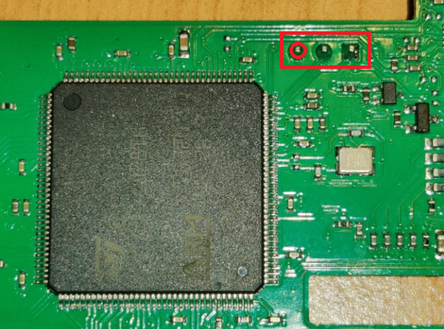
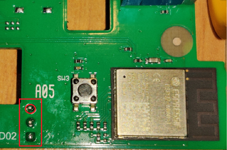
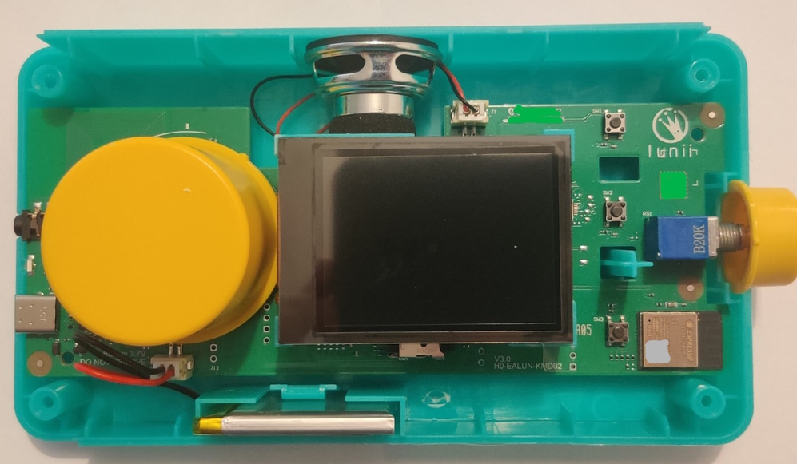
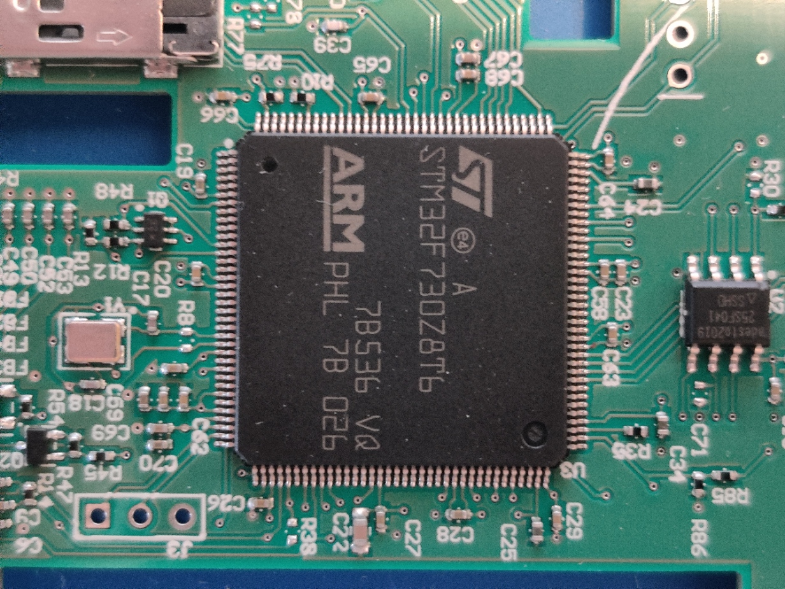
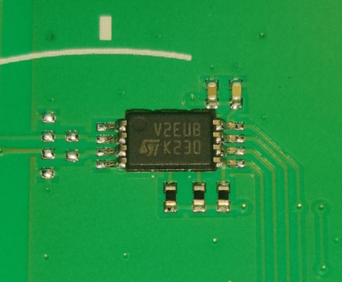
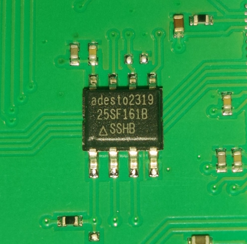
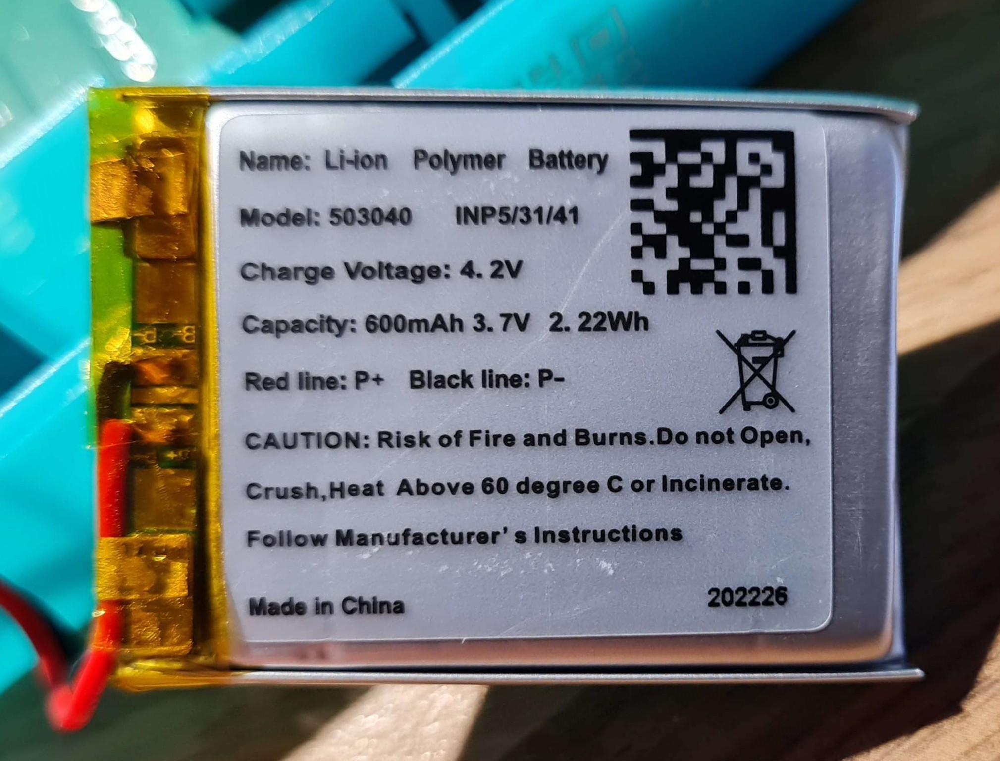
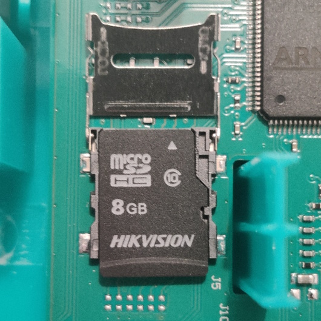
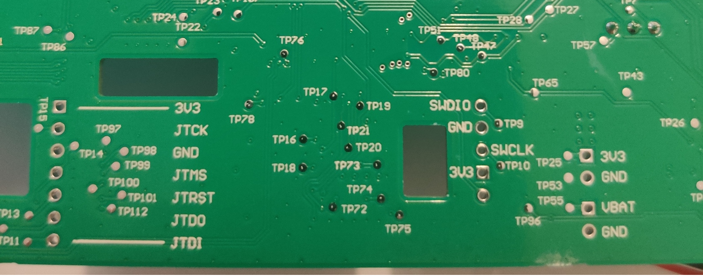

# Hardware
(based on FW analysis + pictures of board)

* Torx n°6
* Battery : Li-ion 4.2v 600mAh   
  Model 503040 - 1INP5/31/41
* Main CPU : [STM32F730Z8T6](docs/stm32f730z8.pdf) - Cortex M7 - LQFP144  
  RAM : 256KB / Flash : 64KB
    - [Datasheet + Pinout](docs/stm32f730i8.pdf)
    - [RM0431 - Reference manual](docs/rm0431-stm32f72xxx-and-stm32f73xxx-advanced-armbased-32bit-mcus-stmicroelectronics.pdf)
    - [PM0253 - Programming manual](docs/pm0253-stm32f7-series-and-stm32h7-series-cortexm7-processor-programming-manual-stmicroelectronics.pdf)
* External Flash : adesto AT25SF161 - 16MBits (2MB)
  QSPI interface
  * [Datasheet](docs/AT25SF161-Adesto.pdf)
* ST25DV04K (I2C interface)
  * [Datasheet](docs/st25dv04k.pdf)
  * [AN5439 - Application note](docs/an5439-augmented-ndef-with-st25dvi2c-series-dynamic-nfc-tags-stmicroelectronics.pdf)
* Wifi module : Espressif ESP32-MINI-1
  * [Datasheet](docs/esp32-mini-1_datasheet_en.pdf)
* SD 8GB (SDIO interface)

To be checked
* Voltage Regulator : AP7362 (DIODES) 4.2v -> 3.3v
* Battery Management System (BMS) :  
  * MCP73833
  * BQ25170
* Audio ampli : 
  * PAM8019
  * MAX9792

## Peripherals Mapping
| Peripheral | GPIOx | mask |
|-|-|-|
| Button 1 - HOME | GPIO **A** | `0x00000004` |
| Button 2 - PAUSE | GPIO **C** | `0x00000002` |
| Button 3 - OK | GPIO **C** | `0x00002000` |
| Rotary Wheel U | GPIO **D** | `0x00000800` |
| Rotary Wheel D | GPIO **D** | `0x00002000` |
| Rotary Wheel L | GPIO **D** | `0x00000400` |
| Rotary Wheel R | GPIO **D** | `0x00001000` |
| USB connected | GPIO **B** | `0x00002000` |
| HW vers 1/2 | GPIO **D** | `0x00000001` |
| HW vers 2/2 | GPIO **D** | `0x00000002` |

### USART4
> TX:PA0(34)  / RX:PA1(35)  - Bootloader debug console  
> Red circle = GND

    (22:57:56.490) [BOOTLOADER]Bootloader v3.0
    (22:57:56.515) [BOOTLOADER]GPIO init
    (22:57:56.515) [BOOTLOADER]DMA init
    (22:57:56.515) [BOOTLOADER]ADC3 init
    (22:57:56.515) [BOOTLOADER]SDMMC2 init
    (22:57:56.515) [BOOTLOADER]QUADSPI init
    (22:57:56.515) [BOOTLOADER]Battery level: 3634
    (22:57:56.525) [BOOTLOADER]check_STOP...
    (22:57:56.525) [BOOTLOADER]Check for firmware update file
    (22:57:56.530) [BOOTLOADER]SDMMC2 init
    (22:57:56.540) [BOOTLOADER]FATFS init
    (22:57:56.540) [BOOTLOADER]FATFS mounted
    (22:57:56.540) [BOOTLOADER]found fa.bin: 611328 bytes
    (22:57:59.526) [BOOTLOADER]Unmount FATFS
    (22:57:59.535) [BOOTLOADER]Unmount result: 0
    (22:58:01.270) [BOOTLOADER]Start Lunii firmware...

### USART8
> RX:PE0(141) / TX:PE1(142) - ESP UART line   
> Red circle = GND

    (20:56:14.521) ets Jul 29 2019 12:21:46
    (20:56:14.538) 
    (20:56:14.538) rst:0x1 (POWERON_RESET),boot:0x17 (SPI_FAST_FLASH_BOOT)
    (20:56:14.538) configsip: 188777542, SPIWP:0xee
    (20:56:14.538) clk_drv:0x00,q_drv:0x00,d_drv:0x00,cs0_drv:0x00,hd_drv:0x00,wp_drv:0x00
    (20:56:14.552) mode:DIO, clock div:1
    (20:56:14.552) load:0x3fff0030,len:7360
    (20:56:14.552) load:0x40078000,len:16684
    (20:56:14.552) load:0x40080400,len:4280
    (20:56:14.552) entry 0x40080634
    (20:56:14.552) <ESC>[0;32mI (28) boot: ESP-IDF v5.0-beta1-764-gdbcf640261 2nd stage bootloader<ESC>[0m
    (20:56:14.564) <ESC>[0;32mI (28) boot: compile time 11:18:48<ESC>[0m
    (20:56:14.564) <ESC>[0;32mI (28) boot: chip revision: V301<ESC>[0m
    (20:56:14.592) <ESC>[0;32mI (33) boot_comm: chip revision: 3, min. bootloader chip revision: 0<ESC>[0m
    (20:56:14.592) <ESC>[0;32mI (40) qio_mode: Enabling default flash chip QIO<ESC>[0m
    (20:56:14.592) <ESC>[0;32mI (45) boot.esp32: SPI Speed      : 80MHz<ESC>[0m
    (20:56:14.592) <ESC>[0;32mI (50) boot.esp32: SPI Mode       : QIO<ESC>[0m
    (20:56:14.592) <ESC>[0;32mI (54) boot.esp32: SPI Flash Size : 4MB<ESC>[0m
    (20:56:14.592) <ESC>[0;32mI (59) boot: Enabling RNG early entropy source...<ESC>[0m
    (20:56:14.609) <ESC>[0;32mI (64) boot: Partition Table:<ESC>[0m
    (20:56:14.609) <ESC>[0;32mI (68) boot: ## Label            Usage          Type ST Offset   Length<ESC>[0m
    (20:56:14.609) <ESC>[0;32mI (75) boot:  0 phy_init         RF data          01 01 0000f000 00001000<ESC>[0m
    (20:56:14.625) <ESC>[0;32mI (82) boot:  1 otadata          OTA data         01 00 00010000 00002000<ESC>[0m
    (20:56:14.625) <ESC>[0;32mI (90) boot:  2 nvs              WiFi data        01 02 00012000 0000e000<ESC>[0m
    (20:56:14.642) <ESC>[0;32mI (97) boot:  3 at_customize     unknown          40 00 00020000 000e0000<ESC>[0m
    (20:56:14.642) <ESC>[0;32mI (105) boot:  4 ota_0            OTA app          00 10 00100000 00180000<ESC>[0m
    (20:56:14.659) <ESC>[0;32mI (112) boot:  5 ota_1            OTA app          00 11 00280000 00180000<ESC>[0m
    (20:56:14.659) <ESC>[0;32mI (120) boot: End of partition table<ESC>[0m
    (20:56:14.659) <ESC>[0;32mI (124) boot_comm: chip revision: 3, min. application chip revision: 0<ESC>[0m
    (20:56:14.684) <ESC>[0;32mI (131) esp_image: segment 0: paddr=00100020 vaddr=3f400020 size=2e240h (188992) map<ESC>[0m
    (20:56:14.713) <ESC>[0;32mI (192) esp_image: segment 1: paddr=0012e268 vaddr=3ff80063 size=00008h (     8) load<ESC>[0m
    (20:56:14.732) <ESC>[0;32mI (192) esp_image: segment 2: paddr=0012e278 vaddr=3ffbdb60 size=01da0h (  7584) load<ESC>[0m
    (20:56:14.732) <ESC>[0;32mI (200) esp_image: segment 3: paddr=00130020 vaddr=400d0020 size=116b58h (1141592) map<ESC>[0m
    (20:56:15.041) <ESC>[0;32mI (520) esp_image: segment 4: paddr=00246b80 vaddr=3ffbf900 size=037cch ( 14284) load<ESC>[0m
    (20:56:15.057) <ESC>[0;32mI (525) esp_image: segment 5: paddr=0024a354 vaddr=40080000 size=1e364h (123748) load<ESC>[0m
    (20:56:15.097) <ESC>[0;32mI (566) esp_image: segment 6: paddr=002686c0 vaddr=400c0000 size=00064h (   100) load<ESC>[0m
    (20:56:15.097) <ESC>[0;32mI (566) esp_image: segment 7: paddr=0026872c vaddr=50000000 size=00010h (    16) load<ESC>[0m
    (20:56:15.135) <ESC>[0;32mI (587) boot: Loaded app from partition at offset 0x100000<ESC>[0m
    (20:56:15.135) <ESC>[0;32mI (587) boot: Disabling RNG early entropy source...<ESC>[0m
    (20:56:15.289) no external 32k oscillator, disable it now.<CR>
    (20:56:15.383) module_name:MINI-1<CR>
    (20:56:15.405) max tx power=78,ret=0<CR>
    (20:56:15.405) 2.5.0<CR>
    (20:56:16.695) BLUFI BLE is not connected yet
    (20:56:16.961) BLUFI BLE is not connected yet
    (20:56:16.977) BLUFI BLE is not connected yet
    (20:56:16.977) 192.168.4.1<CR>

(recovered from `TM_dump_sate`)
* GPIOA
  - Audio Jack inserted
  - USB Connected
  - Bouton 1
* GPIOC
  - Bouton 2
  - Bouton 3
* GPIOD
  - Molette
  - Hardware Verion on 0x0F
* GPIOF - battery level (linked to DAC)
* GPIOB - audio chip / HP
* GPIOE - display ?

Check for pin mapping (UART4)

# Pictures

## Main Board

## STM32F730Z8T6

## External Flash & NFC Frontend

## Battery

## µSD

## JTAG & SWD

